<!-- Animated Typing Header -->

<!-- Profile Views & Followers -->

  
  

<!-- Social Badges -->

🧑‍💻 About Me
I build systems that move data fast and think a little. Go for backends, Python for AI, React for interfaces. Currently shipping a Kafka-based log pipeline and an AI review platform. I like clean code, observable systems, and coffee.
🚀 Languages

  
  
  
  
  
  

⚡ Backend & APIs

  
  
  
  
  
  
  
  

🎨 Frontend

  
  
  
  
  
  
  
  

🗄️ Databases & Storage

  
  
  
  
  
  

📡 Message Brokers & Streaming

  
  

🤖 AI / ML & Data

  
  
  
  
  

🐳 DevOps & Observability

  
  
  
  
  
  

<!-- Self-hosted SVGs — auto-generated daily by GitHub Actions -->

  
<!-- Streak stats — external but generally stable -->

